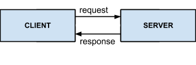
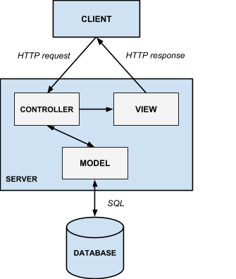
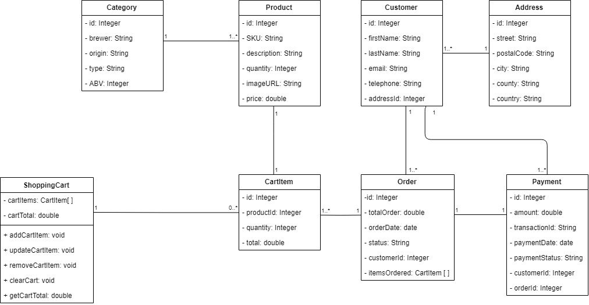
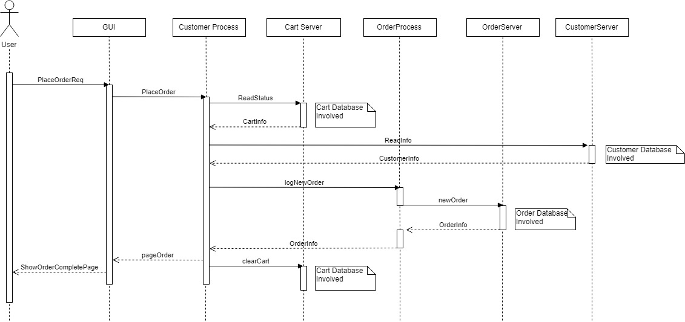

# OO Design & UML
## System Architecture
**Database**

Without even designing the architecture of our system, we already know that it will require a Database - e-commerce applications highly depend on and require consistent access to some persistent store of data about the products on sale, the orders made and such. The most efficient and popular way to store such information is via a Database; which we will most likely implement using MySQL and Spring inbuilt methods.

By referencing out requirements, we have come up with the following Database design.

![Database][logo]

[logo]: img/database.png "Database"

**System Model**

At the highest level, our system will follow the Server-Client model - it is the very nature of a web application:

However, only considering our system using this high-level model does not offer any useful insight to the architecture and design of the server. The tried-and-tested Model-View-Controller (MVC) Model is a common architecture for applications where there is some form of back-end processing of data that is then displayed visually:

Using the MVC model, the components of our system will fall under one of the three following categories:
1. **Controller**: receives requests (e.g. HTTP requests) and controls the View and Model accordingly to formulate the response (e.g. queries the database and get the Model to update with the results, or gets the View to update a webpage to show some data).
1. **Model**: Encapsulates the state of the application (e.g. the different data, objects and entities). Practically, it holds all the data from the system database so it can be used by the Controller and View.
1. **View**: Renders the Model of the application (e.g. generates pages of the website). The response made to the user comes from the View (e.g. returns the page they requested).

We know that we will build our system on the Spring framework, as it is recommended for developing web applications. Fortunately, Spring supports building applications that follow the MVC model - however, as we are not yet familiar with the framework, we cannot yet outline how the MVC model will be incorporated technically. Using it abstractly is still very useful for determining the object-oriented design of the system.

## Object-Oriented Design

The Model encapsulates the state. In our case, the state is essentially the data from the database that is in use at a given time by the client. Therefore, we can create a class inside the Model for each entity in the database.

The entities that exist in the database are:
 * A User
 * An Item (e.g. a beer)
 * A Shopping Cart
 * An Order

Using these entities’ fields and their relationships in the database, as well as functional requirements for the system components which interact with these entities, we can determine the attributes and methods their corresponding classes will have. For example:

 * In the database design, it states that a shopping cart can have 0 or more beer items in it - this implies that our Shopping Cart item will need some sort of list that can hold multiple Items.
 * The Order table has fields for customer details, so the Order class will need to have them too.
 * In our system requirements, it states that users can add, edit and remove items in the shopping cart - therefore, our Shopping Cart class will need methods that offer this functionality.
 
## Static UML Modelling of the software system

The static UML diagram was created having the use-cases in mind; in order to fulfill the main goals of our project we will need to incorporate and link the following core components:
 * Item
 * Shopping Cart
 * Order
 * Customer
 * Payment
 
and other classes which will facilitate the linking between them.

The static UML diagram illustrates the classes that need to be created in the development process and the dependencies between them. 
The “Category” class will contain ids mapping to possible combinations between the attributes of a beer (brewer, origin, type and alcohol percentage) present in the shop.
The “CartItem” has to keep an id, a quantity and a total price for individual products added to the shopping cart.
The “ShoppingCart” is one of the core components of our e-commerce website. It needs to be implemented such that it will contain a list of products added to the cart (cartItems) and a total price of the order. Also, it will have functions to add a product to the cart, remove a product from the cart, update the cart when a product of the same type is added or removed, clear the cart (removing all the items from the current order), and a function to calculate the total price.
An Order object will need to remember the details of the order (total, date, status, the customer who ordered, the items ordered) and will be identifiable for query searches by an id field.
The Customer object will be used to log the customer details in the database and to connect him with his order by an id. The object will also need to store private fields of personal details.
We use another object to store the address of a client when logging an order.

The Payment object will need to retain the details of the payment (amount, date, payment status), will need to be identifiable in the database by an id, and will need to be connected to the customer and the order to which it belongs to.

Although we are aware of the high risk of uncertainty regarding the development of our project, we will start developing in small increments and update the diagram along with the development process.

**Knowledge obtained from designing the UML diagram**

The static UML diagram allows us to have a better vision over the whole structure between the entities involved in the functionality of the project. We know that every class implemented in Spring will be transformed into a table so we have to make sure we understand the links and relationships between them.

## Dynamic UML Modelling of the software system

The dynamic UML schema was made to represent a sequence diagram of the processes happening in the back end when the user of our website places an order and presses on the “Checkout” button on the checkout page. The diagram illustrates the transition between the request on the front end, the data transition to and from the database to keep track of the items ordered, the customer details, and creating a new order in the database.

The sequence diagram was chosen as a model to represent this data transaction due to the fact that it illustrates in a easier way to understand the sequence in which the data should be passed between the processes and when the different methods need to be called.
Also, it gives us a better understanding on when we need to synchronise the writing to the database and when to log the order in the database. The same sequence diagram will need to be created for the other goals identified in the use case diagram to make sure we fully understand the flow of the processes developing in the back end triggered by the actions of the user on the front end.
