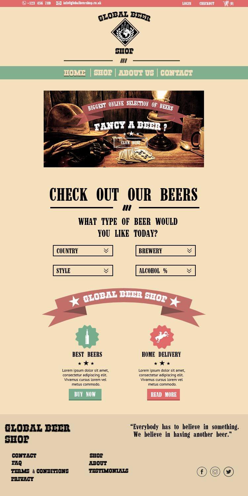

# Overview

### Executive Summary

Global Beer Shop is a business conceptualised by our clients to sell premium beers from around the world - with a target to sell at least one beer from every country that produces it. They wish to begin by selling beers on an eCommerce website and mobile app, then open physical shops around the world upon expansion. The website will act as not only a medium for selling beers, but also as a “portfolio of beers” when contracting new beer distributors. Our clients have already purchased the domain names, _globalbeershop.com_ and _globalbeershop.co.uk_, but have postponed the development of their business for 3 years due to lack of technical skills. 

### Application Domain / Business Sector
Our project is to deliver 1) an e-commerce website for Global Beer Shop, and 2) a corresponding mobile app. In this business sector, the existing competitors (and potentially inspirations) inclue _Beer Hawk, Beers of Europe_ and _Beer Wulf_.

It should be noted that the website is the most important product to create on this project, while creating the app will depend on the time we have left after delivering the website. Our client would prefer a higher quality website with no app, as opposed to rushing the website in order to have time to develop the app. 

### Key Problem 
Our client’s problem is that they are lacking an entry point into the online beer sales market. The e-commerce website and app will solve this problem - using them, the Global Beer Shop will finally be able to market and sell their products accross the UK.

The clients have specified that the website must be aimed at an older, higher-end market (e.g. 25+ year olds interested in novelty/specialised beers). They would prefer if the website had a Western/Wild West inspired theme, and that is should emphasise to customers the global-spanning selection beers - one of the clients suggested even having some form of interactive world map that can show customers the beers currently in stock for a given country. The Global Beer Shop website has to allow for payments via Card, PayPal and Offer Codes.

### Our Vision

Beginning in October 2018, our project will last around 6-months - after which we hope to deliver functioning product(s) to our clients which fulfill all their requirements, along with full system documentation. However, we have chosen to follow an agile development methodology where the project will be developed iteratively and incrementally; with several version releases of increasing functionality before the final release. We hope to release, in order, the system as a Minimum Viable Product around December 2018, then as a Beta version in February 2019, and finally releasing the Final version around April 2019. This is to maximise the amount of time our clients can interact with some working version of the system before the final release, which will allow us to receive consistent feedback on the development.

To achieve this, we will intially decompose the problem and plan minimal parts of the system as a whole to provide us with a starting point of development; but then we will only design and implement the system as the next version release (e.g. we will first create the Minimum Viable Product, and nothing else). This will be done in such a way that one version will lay the foundations, and in the next iteration, the system's next version will be built directly on top of these foundations. We hope to spend several weeks throuroughly planning and designing the current system version, which will then be implemented iteratively over Sprints of around 1-2 weeks.

This agile methodology primarily focuses on software development - however, we will use a similar prototype-based development process for the front-end website User Interface; which will be an incredibly important part of system. The UI will be designed follwoing the Rapid Prototyping Process:
1) Paper Prototyping
1) Digital Prototyping
1) Native Prototyping

Starting with Paper Prototyping, we will (and already have since our initial meeting with client) sketch our rough ideas and designs for the webpages. This is because the Digital and Native prototyping is more expensive, and it is easier to go wrong on paper. We expect our initial sketches to require a lot of improvement. Once the clients are happy with our sketches, we can finally create Digital Prototype on photoshop which will act as a mock-up of the design. These mock-ups will be used during the actual development of the webpages in code, which will be our Native Protototypes that can be refined over time if necessary.

An example of one the Digital Prototypes we have created already is a potential Western-inspired Home Page:

