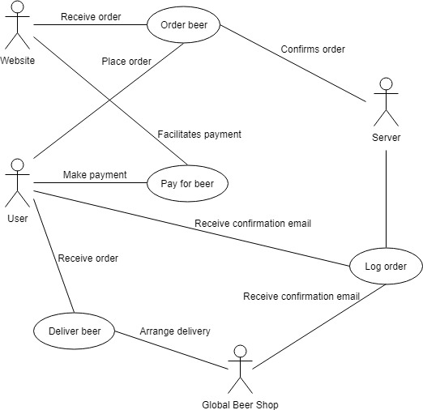
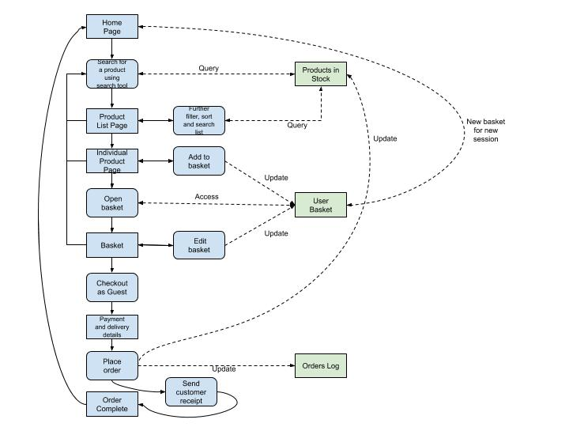

# Requirements
## Stakeholders, Actors and Goals

Based on our project’s application domain, business sector and key problem; we can determine that the key stakeholders of our final product(s) will eventually be:

* __Global Beer Shop:__ Will own, run and profit from the website we create for them.
* __Legislators:__ Are able to pass laws which may affect the way the company/website is run. They will also continuously regulate the website.
* __Users:__ Directly interact with the website we create, either by browsing or buying beers.
* __Delivery Services:__ Will be making beer deliveries for the website after a purchase.
* __Beer Distributors:__ Will be obtaining another medium in which to sell their product.
* __Server Company:__ Will be running another website on their servers.
* __Database Company:__ Will host another database.
* __Competitors:__ Will have a new competitor to their business which could affect sales and/or website traffic.
* __Banks:__ Will gain a new company account.

However, in the scope of our project, we will not interact with a majority of these parties (e.g. they are stakeholders for Global Beer Shop as a business using our product, but our project is solely to develop the product for Global Beer Shop). As developers, we have to consider the System Actors - these are the stakeholders that will interact directly with our product- we have determined our actors to be:

* __Customer:__  They will be searching for and buying beer through the site.
* __Website:__ The frontend and User Interface of the system through which the Customer can interact with the system.
* __Server:__ The dynamic backend software that responds to Customer interactions via the Website, provides a majority of the system functionality and manages the database.
* __Global Beer Shop:__ our clients and their company.

All of these actors interact together to accomplish “goals” (e.g. Customer orders a beer on the Website) and they perform different tasks to do this. 

By considering the functionality our clients require from the final system, we can outline all the goals of our actors and their interactions in the following use-case diagram:

The most key goals, and the steps involved in achieving them are as follows:

---
<strong><ins> ORDER BEER </ins></strong>

_BASIC FLOW: user adds beer to basket_
1) Consider beer catalogue.
2) Filter beers/ search for beer.
3) Try to add quantity of beer to basket.
4) Server checks stock is available.
5) Add quantity of beer to basket.
6) Redirect user to beer catalogue.

_ALTERNATIVE FLOW: user removes beer from basket_
1) User inspects basket.
2) User removes beer from basket (assuming beer is in basket).
3) Beer is cleared from basket.

_ALTERNATIVE FLOW: user increases quantity of beer in basket_
1) User inspects basket.
1) User tries to change quantity of beer in basket.
1) Server checks if requested amount of beer is available.
1) Server updates quantity of that beer in the User’s basket

_EXCEPTIONAL FLOW: not enough available stock of that beer_
1) Consider beer catalogue.
1) Filter beer/ search for beer.
1) Try to add beer to basket.
1) Server checks stock is available.
1) Error message.
1) Redirect customer back to beer catalogue.			
---
<strong><ins>PAY FOR BEER</strong></ins>

_BASIC FLOW: payment goes through without issues_
1) Customer goes to checkout.
1) Server re-checks if there is still enough available stock.
1) Server reduces the available stock.
1) Customer puts in details.
1) Customer views delivery options
1) Customer chooses delivery option.
1) Customer views payment options.
1) Customer chooses payment option. 
1) Customer purchases order.
1) Server updates total stock to match available stock.
1) Server redirects Customer to Order Completion page

_ALTERNATIVE FLOW: customer cancels checkout_
1) Customer goes to checkout.
1) Server re-checks if there is still enough available stock.
1) Server reduces the available stock.
1) Customer puts in details.
1) Customer views delivery options
1) Customer chooses delivery option.
1) Customer views payment options.
1) Customer chooses payment option. 
1) Customer cancels checkout.
1) Server increases the available stock to previous amount.
1) Customer is redirected to basket.

_EXCEPTIONAL FLOW: customer payment is unsuccessful or details entered are invalid_
1) Customer goes to checkout.
1) Server re-checks if there is still enough available stock.
1) Server reduces the available stock.
1) Customer puts in details.
1) Customer views delivery options
1) Customer chooses delivery option.
1) Customer views payment options.
1) Customer chooses payment option. 
1) Checkout fails due to unsuccessful payment or invalid details.
1) Customer is shown error message.
1) Server increases the available stock to previous amount.
1) Server redirects Customer to Basket.
---
<strong><ins>LOG ORDER</strong></ins>

_BASIC FLOW: order is logged into database_
1) Order is placed and paid for.
1) Order is logged into database.
1) Email is sent to customer and GBS.

_EXCEPTIONAL FLOW: server crashes_
1) Order is placed and paid for.
1) Attempt to log order to database, but it is down.
1) Server is returned to previous backup.
1) Second attempt to log order to database.
1) Email is sent to customer and GBS.
---
<strong><ins>DELIVER BEER</strong></ins>

_BASIC FLOW: GBS sends beer to customer_
1) GBS view order email.
1) GBS arrange for beer delivery.
1) Beer is successfully delivered by courier.

_EXCEPTIONAL FLOW: Order is canceled after ‘Log Order’_
1) GBS view order email.
1) GBS arrange for beer delivery.
1) Client cancels order.
1) Revert database.
1) Send email to client and GBS to confirm cancellation of order.
---
## MVP System Requirements

As stated earlier, our project will follow an incremental, iterative approach; where we hope to deliver the applications over several releases of increasing functionality and quality. Our first release planned is that of our Minimum Viable Product (MVP), which the later Beta and Final releases will be built upon.

Staying true to our agile approach, we will now consider the MVP our current “sub-project” and will continue the planning and designing just for the MVP. The MVP will be the absolute minimal solution to the problem at hand, and must only include features deemed essential to providing e-commerce functionality.

We will elicit the MVP’s requirements by considering an abstract e-commerce website and what we consider is the simplest set of features we’d expect it to have to allow us to purchase a product on it. 
Using this, we can reduce the use-case goals we established earlier for the final release version into the optimal set required for just the MVP version:

The diagram above represents the structure of the MVP and highlights the most key functionality (both in the front end and back end) that it should provide. Alongside our use-case flows and requirements given by our clients, we can use this MVP structure to finally elicit our MVP’s system requirements:

---
<strong><ins>GENERAL USER INTERFACE</strong></ins>

_FUNCTIONAL_
1) The website should have a Wild West inspired design
1) The website must, at least, consist of:
    1) a Home Page
    1) a Product List page
    1) an Individual Product page
    1) a Shopping Cart page
    1) a Checkout page
    1) an Order Completion page
1) All pages must have a Header and a Footer.
1) The Header and Footer should include the Global Beer Shop logo and slogan(s).
1) The Header should have links to:
    1) Home Page
    1) Product List
    1) Shopping Cart
1) The Footer should have links to:
    1) Global Beer Shop social media accounts
    1) Contact Us page
    1) FAQs
    1) Terms and Conditions
    1) Privacy.

_NON-FUNCTIONAL_
1) The style and theme of the website design must be consistent throughout all pages.
---
<strong><ins>USER HTTP SESSIONS</strong></ins>

_FUNCTIONAL_
1) When a new user accesses the website, the server must:
    1) Assign that user an unique session ID
    1) Log that session
1) When a session expires, the server must:
    1) Unlog that session
    1) Remove any temporary data stored during that session.

_NON-FUNCTIONAL_
1) Sessions must be given a maximum time limit of 1 hour, in case that a user’s browser does not automatically close their sessions after the page is closed.
---
<strong><ins>SEARCH TOOL</strong></ins>

_FUNCTIONAL_
1) Users should be able to use the Search Tool to find products based on:
    1) Country of Origin
    1) Brewer
    1) ABV
    1) Beer Type
1) Using the Search Tool must redirect the user to the Product List page, where the products displayed are either:
    1) The products that meet the query requirements inputted by the user.
    1) All the products in stock, if no query requirements were given.

_NON-FUNCTIONAL_
1) The Search Tool must be re-usable on various pages, including as a “filter” tool (functionally identical).
1) The input options that the Search Tool offers must only include those for available products (e.g. you can’t search for a product by an attribute that no product currently has).
1) It should not take any longer than 15 seconds for the User to be displayed search results after using the Search Tool.
---
<strong><ins>HOME PAGE</strong></ins>

_FUNCTIONAL_
1) The Home Page must:
    1) Publicize the services offered by the Global Beer Shop
    1) Encourage users to view products on sale
    1) Provide a Search Tool that allows users to find certain product(s)
    1) Include the company slogan
1) The Home Page should:
    1) Include an interactive map of the world that allows users to view all products in stock that originate from a specific country.
    1) Recommend certain products

_NON-FUNCTIONAL_
1) The Home Page should:
    1) Avoid using excessive amounts of text
    1) Emphasise the use of images.
---
<strong><ins>PRODUCT LIST</strong></ins>

_FUNCTIONAL_
1) Products must be displayed with at least their name, price and image.
1) Users can change the order in which the products are displayed in
1) Products must be displayed in the order specified by the user, if one has be specified.
1) Users can choose to filter/re-search for products to be displayed.
1) The only products displayed must be those that match the filter/search requirements of the user, if such requirements have been given.
1) If a User clicks on the image or name of a product on display, they must be redirected to that product’s corresponding Product page.
1) As not all products can be on display at once, the User must be able to navigate through the various display sets of the products.
1) Returning to a given display set of products must display the same products as before, if the filter/sort requirements are unchanged.

_NON-FUNCTIONAL_
1) By default, the products should be sorted in ascending alphabetical order.
1) Products should be clearly labelled if they are in or out of stock.
1) Products and their details on display must be segregated from others so products can be easily distinguished from one another.
1) Only a maximum of 12 products can be on display at once.
---
<strong><ins>INDIVIDUAL PRODUCT</strong></ins>

_FUNCTIONAL_
1) For a given product, the page must display:
    1) The name
    1) The price
    1) At least one image
    1) The type of the product
    1) The product’s ABV
    1) Country of Origin
    1) A short description of the product
1) The product can be added to the user’s Shopping Cart, in varying quantity.
1) A product can only be added to a Shopping Cart if, at the time of the attempt, the quantity being added is less than or equal to the available stock of that product.

_NON-FUNCTIONAL_
1) If a product cannot be added to the Shopping Cart due to insufficient stock, the user must be alerted of this.
1) The default quantity that products are added to the Shopping Cart is 1.
---
<strong><ins>SHOPPING CART</strong></ins>

_FUNCTIONAL_
1) For each current user session, there will be a Shopping Cart.
1) The Shopping cart must display:
    1) All items that have been added to it and not removed
    1) These items’ quantities
    1) The subtotal for these items
    1) The overall basket total.
1) Unless modified by the user, the contents of the shopping cart must stay consistent until either:
    1) The order checkout is complete
    1) The user’s HTTP session expires.
1) While in the Shopping Cart, Users must be able to:
    1) Remove items from their basket
    1) Edit the quantities of items in the Cart
    1) Checkout their order as a guest (e.g. doesn’t need to create an account to purchase).
1) For the user to be able to checkout their order:
    1) There must be at least one item in the cart.
    1) The quantities of each item in the cart must be less than or equal to the available stock for that item at the time of checkout.

_NON-FUNCTIONAL_
1) Each user session can only have one Shopping Cart.
1) If the Shopping Cart is empty:
    1) It should not display any items
    1) It should encourage the user to browse the beers on offer.
1) The maximum net amount of stock (regardless of which product) that can be added to the Shopping Cart is 100 units.
1) The total of the Shopping Cart must be updated every time that:
    1) A user navigates to the Shopping Cart page.
    1) An item is added by the corresponding user to the Cart.
1) The user cannot add to the shopping cart more items than the number of items available in stock.
---
<strong><ins>CHECKOUT</strong></ins>

_FUNCTIONAL_
1) The Checkout page must display to the user:
    1) A short summary of the products that the user is attempting to purchase
    1) The final total for the order.
    1) Delivery options, which the user can choose between.
    1) Payment options, which the user can choose between
1) There must at least be a payment option for  “Cash On Delivery”
1) There must be an option that allows the user to cancel the checkout process.
1) When a customer enters the checkout stage, the available stock of each of the products in their Shopping Cart must be reduced by the corresponding quantity in the Shopping Cart.
1) If a customer exits the checkout stage before fully completing it, the available stock of each of the products in their Shopping Cart must be increased by the corresponding quantity in the Shopping Cart.
1) The user must enter their personal, delivery and payment details to complete the checkout. 
1) Checkout can only be completed if all data given by the user is valid.
1) Checkout can only be completed when the selected payment option has been fully processed.
1) If a user’s session expires in the middle of checking out, they must be redirected to the Home Page.
1) If a user chooses to cancel their checkout, they must be redirected to the Shopping Cart.

_NON-FUNCTIONAL_
1) All user input must be validated to be of correct form for that personal/payment/delivery detail being collected.
1) Users must be alerted of any input that is currently invalid.
1) All user input must be processed for SQL injection and Cross-Site Scripting.
1) The Checkout page(s) must use HTTPS (TLS encryption) to protect sensitive user information.
---
<strong><ins>ORDER COMPLETION</strong></ins>

_FUNCTIONAL_
1) Each order completed must be assigned a unique reference number.
1) When an order is complete, the server must:
    1) Reduce the Actual Stock of the products just ordered by the corresponding quantities to reflect the purchase made.
    1) Email the customer to alert them that their order has been a success
    1) Email the Global Beer Shop to alter them that a customer has placed an order
    1) Log the order
    1) Clear the contents of that user’s Shopping Cart.

_NON-FUNCTIONAL_
1) The emails must be sent and received within 12 hours of the order completion.
---
