# Evaluation

_All figures referenced are located at the bottom of this document._

Some of our system’s requirements cannot be checked using unit tests - such as the appearance of the website, user experience and hidden bugs. Therefore we performed an extensive evaluation of our product using a variety of methods, which led to various improvements detailed below.

### Heuristic Checklist: 
When we first felt that we had finished implementation as we passed all tests, we then marked the system against [an external checklist for ecommerce websites](https://www.thinkmind.org/download.php?articleid=achi_2014_2_10_20126). This ensured that our website fell in line with industry standards and helped us spot any glaring problems/missing features.

Most prominently among the features/changes we added from the checklist were product recommendations, and confirmation emails after orders are placed. The checklist recommended a wishlist which would make a good future addition to the site, however as time was limited for this project it was relegated to a stretch goal as it was less vital to the key use cases. The heuristics also called for easy to use filters on the shop page, so small changes were made to simplify them and improve usability.

### Client Feedback:
Before performing any user evaluation, it was most important for our clients to be happy with the final product (especially with its UI design). During a meeting with the client, we performed a walkthrough with the clients of the website (as we will do later in user evaluation) to make sure they see all features we have implemented.

Fortunately, they were very happy with the system and the y only requested we make some small changes to the colour scheme. This is not surprising because thanks to our use of CircleCI and continous deployment, we were able to present the system to our clients after every sprint where we had made some changes. We received constant feedback which was fed direclty into our iterative development.

### Stress Testing:
Some of our non-functional system requirements cover the ability of the system on a server. To evaluate how well our hosted website handles higher traffic, [we tested it using LoadImpact](https://app.loadimpact.com/) which sent virtual users to the site. As you can see in Figure 1, the tests proved the server could serve at least 25 clients at once, fulfilling our requirements - therefore no changes were required. 

### Questionnaire:
Questionnaires were used to collect qualitative data. 15 questionnaires were filled out, the results can be seen in Figure 2. The majority of the comments were positive and all multiple choice questions scored well, which we see as an indicator of the website succeeding at non-functional user experience requirements. The open ended comments section at the end of the questionnaire was the most useful, with multiple comments suggesting changes needed to be made to the site to clarify/reduce the need for scrolling (see Figure 2.2). Ultimately there was a choice between removing the images at the top of the page or adding scrolling indicators and after discussing with the clients, the indicators were added: they reasoned that the pictures were vital in conveying the western theme which was a key design feature requested.

N.b. As our Braintree payment service was being used in development mode, the subjects were asked to our development PayPal “Sandbox” accounts (e.g. a set of fake details). Multiple people tried to use the same login at the same time - which caused some issues with paypal, which explains the dip in success for some of the tasks in the Figure 2.1.

### Walkthroughs and Interviews:
Where the questionnaire helped us to evaluate the usability of the system, the walkthroughs were vital for inspecting the utility of the system. Combining the methods together, we were able to find the usefulness of the site and improve it, which is the key metric for evaluation.

Walkthroughs involved sitting next to first time users as they performed given tasks, which enabled us to collect statistical data such as number of clicks and also to gain insight on problem areas for new users. Watching the key use cases being run through so many times and on multiple devices (iPad, PC, Phone) was particularly useful in ironing out small bugs which we hadn't noticed before, such an email with an incorrect title. 

The subjects in the interviews believed that the site enabled key use actions to be performed in a reasonable time- also supported by the timings data which shows that most were performed in under a minute (see Figure 3.1), fulfilling user experience requirements. We noticed other subjects having difficulty with the password requirements, such as needing a special character. This explained the lower ratings for ease of setting up an account and so the requirements were removed. One interviewee noticed that the prices were not being displayed in a uniform way, which we believed contributed to lowered trustworthiness scores recorded in the questionnaires. After making these changes, subsequent scores were higher (see Figure 3.2).

### Figures:

#### Figure 1: Stress testing graph plotting virtual users with request rate and response time.

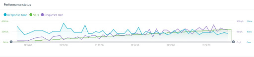

#### Figure 2: All results collected from task based evaluation on 15 users
|  |   |   |
| --- | --- | --- |
| 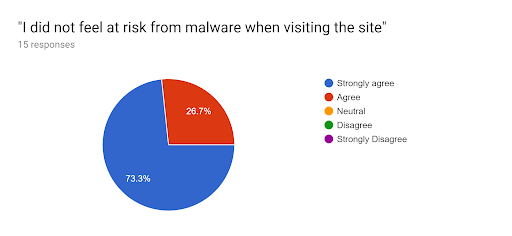 | 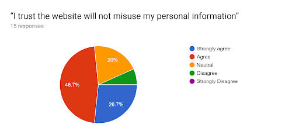 |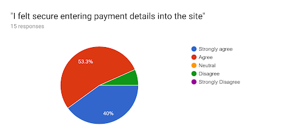 |
| 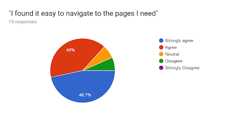 |  |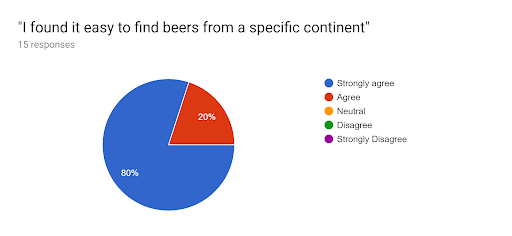 |
| 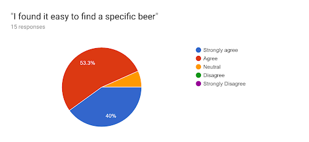 | 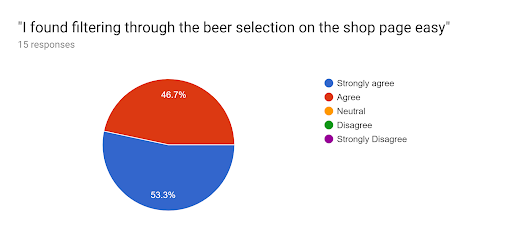 |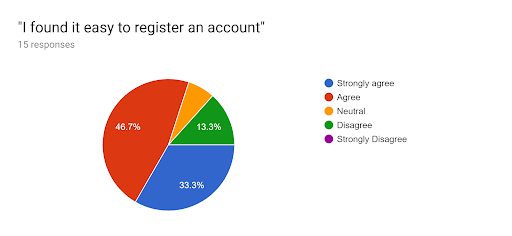 |
| 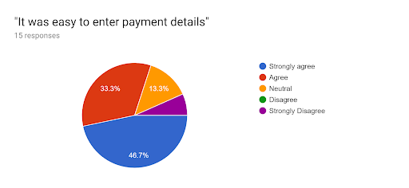 | 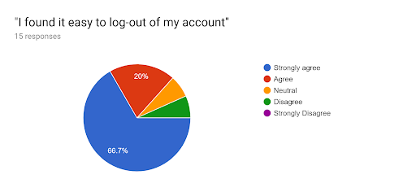 |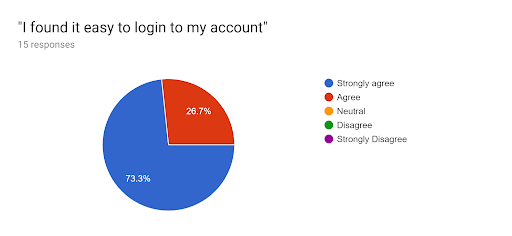 |
| 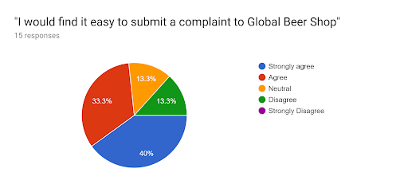 | 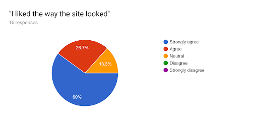 |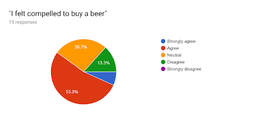 |
| 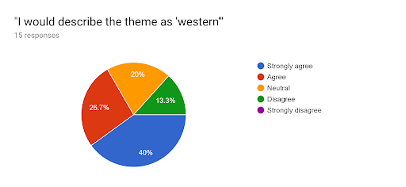 |  |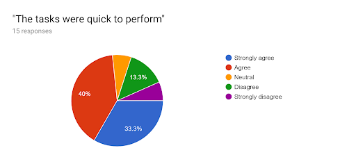 |
| 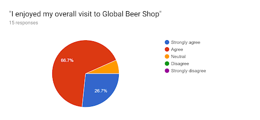 | 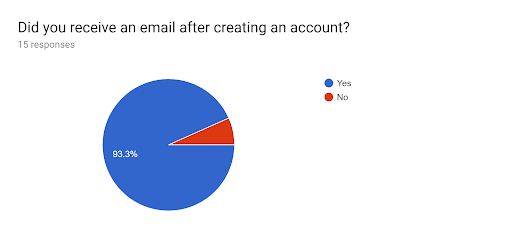 |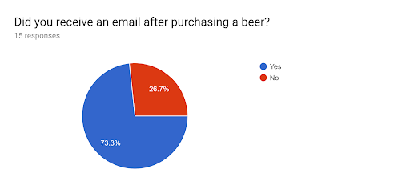 |
 
[alt text](image/chartfinal.png "Final Results")

**_2.1 Result Charts:_**

**_2.2 Written Responses:_**

Question: Would you like to make any comments on the current features?
Answers:
- “It could be more western”
- “nice webby bois”
- “The Paypal checkout system is not good. Lots of lag. After I purchased a beer, I got an email titled 'WARNING' which was somewhat concerning.”
- “It looks really slick! I think the "cart" button should be on the left next to the "account" button.”
- “N/A”
- “looked great”
- “UI a bit clunky- every page has a large image at the top so you have to scroll a lot”
- “Less scrolling please”

Question: Can you think of any other useful features to add to Global Beer Shop? What are they?
Answers:
- “Recommendations for people who have an account and have bought beer from the site
promo codes, trustpilot reviews”
- “Smoother payment process, removal of 'WARNING' email after making a purchase”
- “It would be cool if the map then zoomed in and showed you where the beers were from on the map instead of redirecting to a separate page with just a list of beers.”
- “It's perfect just the way it is, although could be more Western”
- “less filters”
- “Make a tab for the map in the menu”

#### Figure 3: Results from Walkthroughs and Interviews

**_3.1 Data collected during Walkthroughs_**

**_3.2 Conclusions made from Interview_**

1. People don’t like the scrolling, it is confusing that the view returns to the top of the page and the header takes up the whole screen, something that we could improve on in the future.One user even said it would make him use another site. 
1. This testing has included use on a computer, an ipad (tablet) and a phone.
1. Also some users had trouble with the adding to cart returning you back to the top of the screen. With lag this can cause confusion as to what people have put in their cart. 
1. Prices don’t look legitimate. For example, £0.70 was shown as £.70 
1. Graphics at the top of each page should be half the size and have a scroll down indicator.
1. Would like icy mountain graphics
1. Site didn’t remember payment details
1. Final checkout button when purchasing should clarify that it needs to be pressed for the order to go through.
1. Titles at the top of each page should be buttons.
1. Add to cart button should redirect to shop page rather than checkout page.
1. There should be a map tab. 
1. Would like a sticky menu bar at the top (remains in place while scrolling) 
1. Disliked the complicated password requirements

