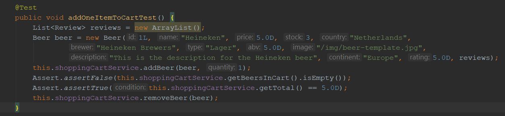

# Development testing

Our testing will be split into three sections, development testing, release testing and acceptance testing. The latter two will take place during the evaluation stage of this project.

Meanwhile, development testing is a key component of our agile and test-driven development strategy. Tests will be written before features to ensure they conform to our requirements. As our system architecture shows, our system will have three major elements which will require testing: the model, the view and the controller..

The controller code will comprise of backend Java code which we can test individual using unit tests with JUnit, while Springs MockMVC to write integration tests for multiple components. This will not only allow us to test if the logic of our system is correct but also if the server context is loading correctly or check the content type of each HTTP response is correct.

However, while testing, we must make sure to not damage our actual stock data in the database. To overcome, we can mock the database with some testing data using Mockito.  However, Mockito is somewhat limited in its simulation of the database. Instead, we will most likely set up a different, in-memory database for when in a testing environment. This will offer the best way to test components that use the database (e.g the repositories) without touching the actual data.

Here is an example of a unit test in Spring for the Shopping Cart:

The view - e.g. the HTML that the user sees - could be tested using htmlUnit and MockMVC. However, in agile development, we can expect that something like our UI will change change rapidly and repeatedly -  it would keep breaking any tests we write for it. Instead,  we plan to validate the view using extensive user testing (e.g. questionnaires, walkthroughs, client feedback) as this will both discover bugs and help improve the appearance of the website (which unit testing cannot do).

A powerful tool in agile development are continuous integration services, such as CircleCI, which automatically perform integration and deployment tests every time one of us push a change to our Git repository. In addition, we can set up CircleCI to also automatically re-deploy our system on the hosting server when change occurs. This is useful as it allows our clients to always see our most recent prototype, and be able to provide feedback for the next iterations - an important part of the final evaluation.
